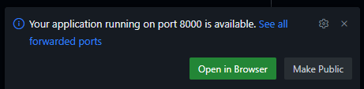

# Welcome to AIRE Documentation Codespace

This codespace contains everything you need to build the Aire docs website.

Hit `Ctrl + Shift + V` to view this as nicely rendered Markdown.

Please read our [contributing guidelines](../CONTRIBUTING.md) and [readme file](../README.md) to ensure you follow good practice (e.g. no edits to the main branch).

You can use `git` as you would locally, including pushing to the remote. You won't have to authenticate, as you're already logged in to GitHub.

## Quick Start

You should automatically have an open terminal with the prompt `(arcdocs-aire-jb) root@codespaces-e8c8b0:/workspace#`.
If not, open a new terminal with `Ctrl + Shift + '`; this terminal should already have the [`arcdocs-aire-jb` conda environment](../environment.yml) activated.

### 1. Build the documentation

```bash
jupyter-book build book/
```

### 2. Serve locally

```bash
python -m http.server -d book/_build/html
```

Then visit the forwarded port 8000 in your browser. VSCode should prompt you to do this with a popup, providing a URL for you to visit (the rmeote-machine equivalent of [localhost:8000](http://localhost:8000/welcome.html)):



## Useful Commands

- **Build book**: `jupyter-book build book/`
- **Clean build**: `jupyter-book clean book/`
- **Check links**: `jupyter-book build book/ --warningiserror --keep-going`
